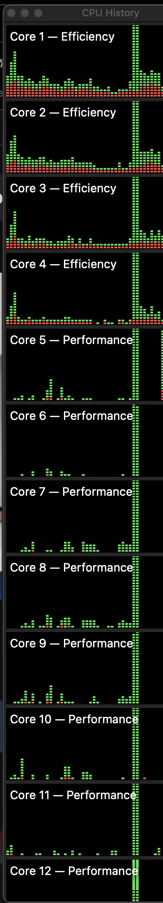

# new-mac-performance-testing

This is a repo on performance testing a back for python and machine learning development. Contains some simple python scripts.

```
cd app 
poetry install
poetry shell
python matrix_multiplication.py
```

# 2023 M3 Max Macbook Pro

Results: Matrix multiplication of size 16000x16000 took 16.08 seconds

# View Core Utilization

1. Open Activity Monitor
2. Right Click the Activity Monitor Dock Icon
3. Select Monitor -> Show CPU History



# References

- https://github.com/alexziskind1/machine_tests/tree/main/python/matrix_multiplication
- https://github.com/PlummersSoftwareLLC/Primes
- https://benchmarksgame-team.pages.debian.net/benchmarksgame/program/mandelbrot-python3-7.html