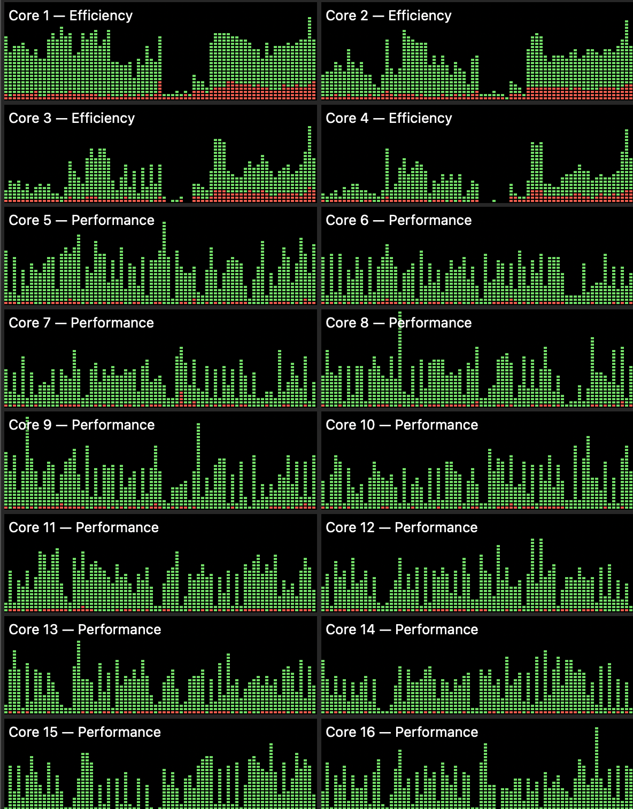

# New Mac Performance Testing

This is a epo for performance testing a backend for Python and machine learning development.. Contains some simple Python scripts.

- Python Matrix Multiplication
- GPU Benchmarking (Pytorch) (Notebook)

```bash
# This example uses python 3.11
cd app 
poetry install
poetry shell
python ./scripts/matrix_multiplication.py
```

## 2023 M3 Max MacBook Pro

Results: Matrix multiplication of size 16000x16000 took 16.08 seconds

### View Core Utilization

1. Open Activity Monitor
2. Right Click the Activity Monitor Dock Icon
3. Select Monitor -> Show CPU History

{ width=25% }

### View GCP Utilization

1. Open Activity Monitor
2. Select Window in the Menu Bar -> GPU History


### Machine Learning Performance (Pytorch Matrix Multiplication)

You can view the notebook [here](./app/notebooks/gpu_benchmark.ipynb). This notebook runs 30 samples of matrix multiplication of size 50,000x50,000 tensor on both the CPU and GPU. The GPU is ~10x faster than the CPU for machine learning workloads using Pytorch.

I am currently using a 2023 MacBook Pro with a M1 Max Ultra Configuration with 16 core CPU and 40 core GPU and 128GB of unified memory (RAM).


```bash
cd app
poetry install
poetry run jupyter lab 
```

Here are the notebook results:


### References

- https://github.com/alexziskind1/machine_tests/tree/main/python/matrix_multiplication
- https://github.com/PlummersSoftwareLLC/Primes
- https://benchmarksgame-team.pages.debian.net/benchmarksgame/program/mandelbrot-python3-7.html